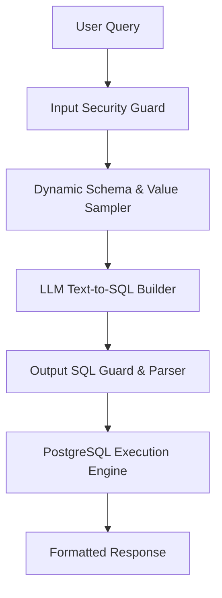

# 📋 Handover Teknikal: Diagnosis & Solusi Arsitektur Universal RAG Text-to-SQL

Dokumen ini disusun sebagai **Instruksi & Evaluasi Arsitektur** untuk diberikan kepada AI Partner / Agent Partner guna menyelesaikan masalah "efek domino" (perbaikan query A merusak query B/D) secara **permanen dan universal untuk seluruh datasource (yang ada maupun yang baru)**.

---

## 🛑 1. Diagnosis Akar Masalah (Mengapa Terjadi Pola "Perbaikan A Merusak B/D")

### Fenomena yang Terjadi:
- Ketika perbaikan dilakukan untuk query `RestNDisc` (Status Diterima) dan `Realisasi UC` (Total Box & TEUS di sheet `OH OW OL`), perbaikan tersebut berhasil.
- Namun saat user mengajukan pertanyaan baru pada dataset `Komersial Dashboard`:
  - *"berapa total box yang domestik dibulan 3 tahun 2023 pada data Komersial Dashboard?"*
  - *"berapa total box internasional dibulan 3 tahun 2023 pada data Komersial Dashboard?"*
  Sistem menjawab: `"Data total box pada tahun 2023 tidak tersedia di dataset Komersial Dashboard."`

### Analisis Penyebab Utama:
1. **Aturan Hardcoded per-Dataset (Ad-Hoc Mapping Trap)**:
   - Kode saat ini menggunakan pemetaan statis (`if dataset == 'Realisasi UC'`, `if dataset == 'RestNDisc'`).
   - Pada `Komersial Dashboard`, filter domestik/internasional tidak disimpan sebagai nama sheet, melainkan sebagai nilai kolom **`DN / LN`** (`'DOMESTIK'` dan `'INTERNASIONAL'`).
   - Kolom bulan pada `Komersial Dashboard` berisi `BULAN` = `'Maret'`, `DATE` = `'01/03/2023'`, `YEAR` = `2023`, `TOTAL BOX` = `13183`.
   - Pendekatan ad-hoc regex & static dictionary gagal mengenali bahwa `"domestik"` adalah isi dari kolom **`DN / LN`** pada `Komersial Dashboard`.

2. **Ketiadaan Schema & Value Sampling Context**:
   - Query Builder tidak dibekali dengan **sampel nilai unik aktual per kolom** (seperti `DN / LN: ['DOMESTIK', 'INTERNASIONAL']`, `STATUS: ['Diterima', 'Ditolak']`).
   - Akibatnya, LLM/Rule engine tidak tahu kolom mana yang harus difilter untuk frasa `"domestik"` atau `"internasional"` pada dataset yang baru atau berbeda struktur.

---

## 💡 2. Solusi Arsitektur Universal Berdasarkan Project Referensi (`rag-komersial-tps`)

Agar perbaikan berlaku **otomatis untuk SELURUH datasource (tanpa perlu menulis `if-else` manual per dataset/sheet baru)**, berikut 3 pilar arsitektur yang diterapkan di `rag-komersial-tps`:



### Pilar 1: Dynamic Schema & Value Sampling
- Sebelum merakit query, engine secara otomatis mengambil **Daftar Kolom + 5 Sampel Nilai Unik per Kolom** dari database PostgreSQL untuk dataset terkait:
  - Dataset `Komersial Dashboard`:
    - `DN / LN`: `['INTERNASIONAL', 'DOMESTIK']`
    - `BULAN`: `['Maret', 'April', 'Mei', ...]`
    - `YEAR` / `TAHUN`: `[2023, 2024, 2025]`
    - `TOTAL BOX`: `[13183, 11339, 1835, ...]`
- Dengan passing sampel nilai ini ke LLM Prompt, LLM secara cerdas tahu bahwa frasa `"domestik"` harus difilter ke `WHERE "DN / LN" = 'DOMESTIK'` tanpa perlu hardcode `if-else`!

### Pilar 2: Multi-Agent Text-to-SQL Generator (Channel-Agnostic)
- LLM bertugas **merakit SQL Query murni** (misal PostgreSQL/DuckDB SQL) berdasarkan skema & sampel nilai di atas:
  ```sql
  SELECT SUM("TOTAL BOX") AS total_box
  FROM data_rows
  WHERE "DN / LN" = 'DOMESTIK'
    AND "BULAN" = 'Maret'
    AND "YEAR" = 2023;
  ```

### Pilar 3: Dual-Layer Security Guard & Fail-Fast Execution
- **Input Guard**: Sanitasi kata kunci berbahaya (semicolon `;`, `--`, `DROP`, `DELETE`).
- **Output Guard**: Validasi sintaks SQL rakitan LLM terhadap skema database. Jika SQL salah, engine melakukan *self-healing retry* 1x sebelum mengeksekusi ke PostgreSQL.

---

## ❓ 3. Lembar Pertanyaan & Solusi yang Diminta dari Agent Partner

Mohon berikan panduan konkret dan cuplikan arsitektur dari project referensi **`rag-komersial-tps`** untuk poin-poin berikut:

1. **Konstruksi Value Sampling Context Prompt**:
   - *Bagaimana struktur prompt dan pengambilan sampel nilai unik kolom (`SELECT DISTINCT column FROM ... LIMIT 5`) di `rag-komersial-tps` agar LLM dapat mengenali bahwa `"domestik"` adalah isi dari kolom `DN / LN` pada `Komersial Dashboard` atau dataset baru lainnya?*

2. **Standardisasi Pipeline Text-to-SQL Tanpa Hardcoded If-Else**:
   - *Bagaimana flow perakitan SQL di `rag-komersial-tps` agar bisa memproses query agregasi (`TOTAL BOX`, `TOTAL TEUS`, `REVENUE`) pada dataset apapun tanpa perlu membuat aturan `route_sheet` atau `if dataset == '...'` secara manual?*

3. **Penanganan Variasi Format Tanggal/Bulan di DB**:
   - *Pada dataset `Komersial Dashboard`, terdapat kolom `BULAN` = `'Maret'`, `DATE` = `'01/03/2023'`, dan `YEAR` = `2023`. Bagaimana strategi penulisan klausa `WHERE` pada `rag-komersial-tps` agar filter bulan 3 tahun 2023 100% tepat sasaran?*
